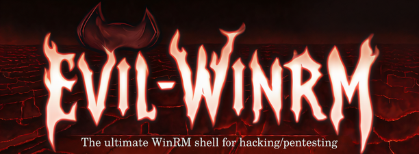
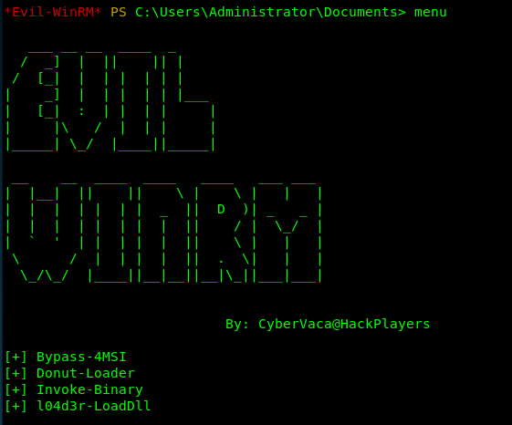
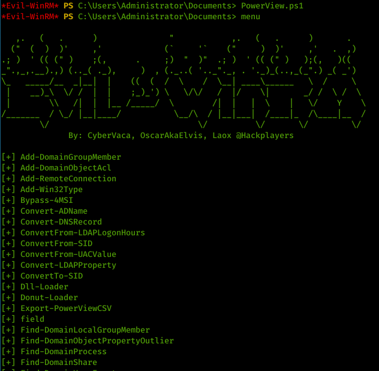
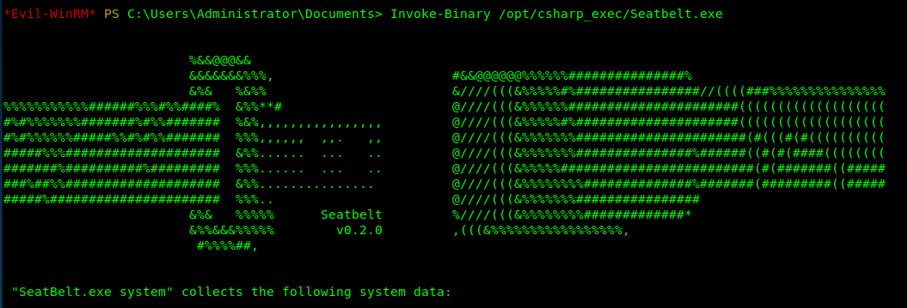
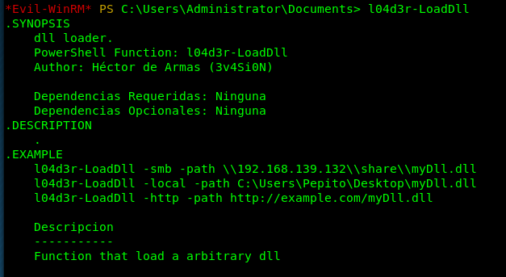
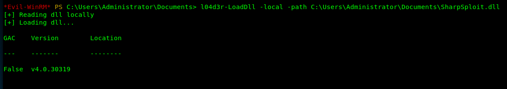
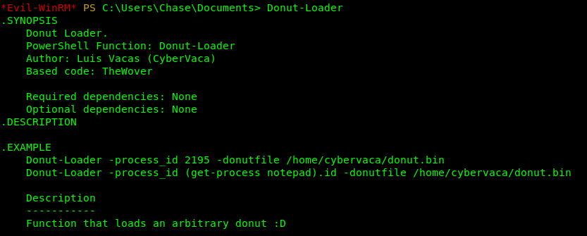
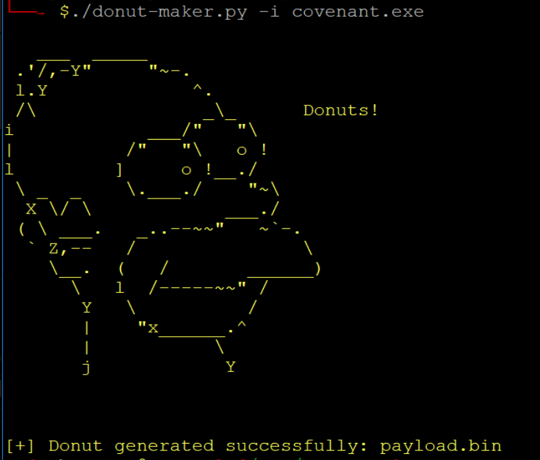

# Evil-WinRM [![Version-shield]](evil-winrm.rb) [![Ruby2.3-shield]](https://www.ruby-lang.org/en/news/2015/12/25/ruby-2-3-0-released/) [![Gem-Version]](https://rubygems.org/gems/evil-winrm) [![License-shield]](LICENSE)
The ultimate WinRM shell for hacking/pentesting



## Description & Purpose
This shell is the ultimate WinRM shell for hacking/pentesting.

WinRM (Windows Remote Management) is the Microsoft implementation of WS-Management Protocol. A standard SOAP based protocol 
that allows hardware and operating systems from different vendors to interoperate. Microsoft included it in their Operating 
Systems in order to make life easier to system administrators.

This program can be used on any Microsoft Windows Servers with this feature enabled (usually at port 5985), of course only 
if you have credentials and permissions to use it. So we can say that it could be used in a post-exploitation hacking/pentesting 
phase. The purpose of this program is to provide nice and easy-to-use features for hacking. It can be used with legitimate 
purposes by system administrators as well but the most of its features are focused on hacking/pentesting stuff.

## Features
 - Command History
 - WinRM command completion
 - Local files completion
 - Upload and download files
 - List remote machine services
 - Load Powershell scripts
 - Load in memory dll files bypassing some AVs
 - Load in memory C# (C Sharp) compiled exe files bypassing some AVs
 - Load x64 payloads generated with awesome [donut] technique
 - Colorization on output messages (can be disabled optionally)
 - SSL and certificates support
 - Pass-the-hash support

## Help
```
Usage: evil-winrm -i IP -u USER [-s SCRIPTS_PATH] [-e EXES_PATH] [-P PORT] [-p PASS] [-H HASH] [-U URL] [-S] [-c PUBLIC_KEY_PATH ] [-k PRIVATE_KEY_PATH ]
    -S, --ssl                        Enable ssl
    -c, --pub-key PUBLIC_KEY_PATH    Local path to public key certificate
    -k, --priv-key PRIVATE_KEY_PATH  Local path to private key certificate
    -s, --scripts PS_SCRIPTS_PATH    Powershell scripts local path
    -e, --executables EXES_PATH      C# executables local path
    -i, --ip IP                      Remote host IP or hostname (required)
    -U, --url URL                    Remote url endpoint (default /wsman)
    -u, --user USER                  Username (required)
    -p, --password PASS              Password
    -H, --hash HASH                  NTLM hash
    -P, --port PORT                  Remote host port (default 5985)
    -V, --version                    Show version
    -h, --help                       Display this help message
```

## Requirements
Ruby 2.3 or higher is needed. Some ruby gems are needed as well: `winrm >=2.3.2`, `winrm-fs >=1.3.2`, `stringio >=0.0.2` and `colorize >=0.8.1`.
Depending of your installation method (3 availables) the installation of them could be required to be done manually.

## Installation & Quick Start (3 methods)

### Method 1. Git clone and install dependencies on your system manually
 - Step 1. Install dependencies manually: `~$ sudo gem install winrm winrm-fs colorize stringio`
 - Step 2. Clone the repo: `git clone https://github.com/Hackplayers/evil-winrm.git`
 - Step 3. Ready. Just launch it! `~$ cd evil-winrm && ruby evil-winrm.rb -i 192.168.1.100 -u Administrator -p 'MySuperSecr3tPass123!' -s '/home/foo/ps1_scripts/' -e '/home/foo/exe_files/'`

### Method 2. Using bundler (dependencies will not be installed on your system, just to use evil-winrm)
 - Step 1. Install bundler: `gem install bundler:2.0.2`
 - Step 2. Install dependencies with bundler: `cd evil-winrm && bundle install --path vendor/bundle`
 - Step 3. Launch it with bundler: `bundle exec evil-winrm.rb -i 192.168.1.100 -u Administrator -p 'MySuperSecr3tPass123!' -s '/home/foo/ps1_scripts/' -e '/home/foo/exe_files/'`

### Method 3. Installation directly as ruby gem (dependencies will be installed automatically on your system)
 - Step 1. Install it (it will install automatically dependencies): `gem install evil-winrm`
 - Step 2. Ready. Just launch it! `~$ evil-winrm  -i 192.168.1.100 -u Administrator -p 'MySuperSecr3tPass123!' -s '/home/foo/ps1_scripts/' -e '/home/foo/exe_files/'`

## Documentation

#### Clear text password
If you don't want to put the password in clear text, you can optionally avoid to set `-p` argument and the password will be prompted preventing to be shown.

#### Ipv6
To use IPv6, the address must be added to /etc/hosts. Just put the already set name of the host after `-i` argument instead of an IP address.

#### Basic commands
 - **upload**: local files can be auto-completed using tab key. It is recommended to use absolute path for destination to avoid errors. Otherwise you could get uncontrolled errors due Winrm-fs limitations. 
   - usage: `upload local_path remote_absolute_path`
 - **download**: It is recommended to use absolute paths to avoid errors. Otherwise you could get uncontrolled errors due Winrm-fs limitations.
   - usage: `download remote_absolute_path local_path`
   
 __Note about paths (upload/download)__:
   If the file to download is in the initial remote dir, absolute path on first parameter can be avoided in order to use simple file name.
   Relative paths are not recommended to use and can cause errors on download/upload.
   Second argument (destination for upload/download) can be blank and in that case it will be uploaded/downloaded to current local dir or initial (landing dir once connected) remote dir.
    
 - **services**: list all services. No administrator permissions needed.
 - **menu**: load the `Invoke-Binary` and `l04d3r-LoadDll` functions that we will explain below. When a ps1 is loaded all its functions will be shown up.

   

#### Load powershell scripts
 - To load a ps1 file you just have to type the name (auto-completion usnig tab allowed). The scripts must be in the path set at `-s` argument. Type menu again and see the loaded functions.

   

#### Advanced commands
- Invoke-Binary: allows exes compiled from c# to be executed in memory. The name can be auto-completed using tab key and allows up to 3 parameters. The executables must be in the path set at `-e` argument.

   


 - l04d3r-LoadDll: allows loading dll libraries in memory, it is equivalent to: `[Reflection.Assembly]::Load([IO.File]::ReadAllBytes("pwn.dll"))`

   The dll file can be hosted by smb, http or locally. Once it is loaded type `menu`, then it is possible to autocomplete all functions.
   
   
   


 - Donut-Loader: allows to inject x64 payloads generated with awesome [donut] technique. No need to encode the payload.bin, just generate and inject!
 
   

    You can use this [donut-maker] to generate the payload.bin if you don't use Windows.
    This script use a python module written by Marcello Salvati ([byt3bl33d3r]). It could be installed using pip: 
  
      `pip3 install donut-shellcode`
   
      


#### Extra features
 - To disable colors just modify on code this variable `$colors_enabled`. Set it to false: `$colors_enabled = false`

## Changelog:
Changelog and project changes can be checked here: [CHANGELOG.md](CHANGELOG.md)

## Credits:
Main author:

 - [cybervaca]

Collaborators, developers, documenters, testers and supporters:

 - [OscarAkaElvis]
 - [jarilaos]
 - [vis0r]

Hat tip to:

 - [Alamot] for his original code.
 - [3v4Si0N] for his awesome dll loader.
 - [WinRb] All contributors of ruby library.
 - [TheWover] for his awesome donut tool.
 - [byt3bl33d3r] for his python library to create donut payloads.
 - [Sh11td0wn] for inspiration about new features.

## Disclaimer & License
This script is licensed under LGPLv3+. Direct link to [License](LICENSE).

Evil-WinRM should be used for authorized penetration testing and/or nonprofit educational purposes only. 
Any misuse of this software will not be the responsibility of the author or of any other collaborator. 
Use it at your own servers and/or with the server owner's permission.

<!-- Github URLs -->
[cybervaca]: https://github.com/cybervaca
[OscarAkaElvis]: https://github.com/OscarAkaElvis
[jarilaos]: https://github.com/jarilaos
[vis0r]: https://github.com/vmotos
[Alamot]: https://github.com/Alamot
[3v4Si0N]: https://github.com/3v4Si0N
[donut]: https://github.com/TheWover/donut
[donut-maker]: https://github.com/Hackplayers/Salsa-tools/blob/master/Donut-Maker/donut-maker.py
[byt3bl33d3r]: https://twitter.com/byt3bl33d3r
[WinRb]: https://github.com/WinRb/WinRM/graphs/contributors
[TheWover]: https://github.com/TheWover
[Sh11td0wn]: https://github.com/Sh11td0wn
<!-- Badges URLs -->
[Version-shield]: https://img.shields.io/badge/version-1.8-blue.svg?style=flat-square&colorA=273133&colorB=0093ee "Latest version"
[Ruby2.3-shield]: https://img.shields.io/badge/ruby-2.3%2B-blue.svg?style=flat-square&colorA=273133&colorB=ff0000 "Ruby 2.3 or later"
[License-shield]: https://img.shields.io/badge/license-LGPL%20v3%2B-blue.svg?style=flat-square&colorA=273133&colorB=bd0000 "LGPL v3+"
[Gem-Version]: https://badge.fury.io/rb/evil-winrm.svg "Ruby gem"
