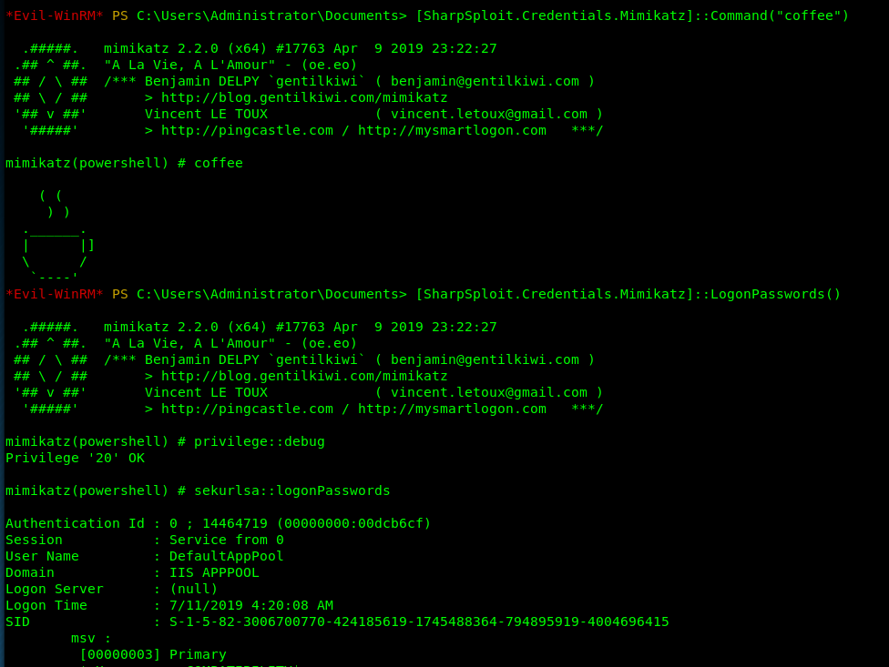

# Evil-WinRM [![Version-shield]](evil-winrm.rb) [![Ruby2.3-shield]](https://www.ruby-lang.org/en/news/2015/12/25/ruby-2-3-0-released/) [![License-shield]](LICENSE)
The ultimate WinRM shell for hacking/pentesting

```
   ___ __ __  ____  _                  
  /  _]  |  ||    || |                 
 /  [_|  |  | |  | | |                 
|    _]  |  | |  | | |___              
|   [_|  :  | |  | |     |             
|     |\   /  |  | |     |             
|_____| \_/  |____||_____|             
                                       
 __    __  ____  ____   ____   ___ ___ 
|  |__|  ||    ||    \ |    \ |   |   |
|  |  |  | |  | |  _  ||  D  )| _   _ |
|  |  |  | |  | |  |  ||    / |  \_/  |
|  `  '  | |  | |  |  ||    \ |   |   |
 \      /  |  | |  |  ||  .  \|   |   |
  \_/\_/  |____||__|__||__|\_||___|___|
                                       

                           By: CyberVaca@HackPlayers
```

## Description & Purpose
This shell is the ultimate WinRM shell for hacking/pentesting.

WinRM (Windows Remote Management) is the Microsoft implementation of WS-Management Protocol. A standard SOAP based protocol 
that allows hardware and operating systems from different vendors to interoperate. Microsoft included it in their Operating 
Systems in order to make life easier to system adminsitrators.

This program can be used on any Microsoft Windows Servers with this feature enabled (usually at port 5985), of course only 
if you have credentials and permissions to use it. So we can say that it could be used in a post-exploitation hacking/pentesting 
phase. The purpose of this program is to provide nice and easy-to-use features for hacking. It can be used with legitimate 
purposes by system administrators as well but the most of its features are focused on hacking/pentesting stuff.

## Features
 - Command History
 - WinRM command completion
 - Local files completion
 - Upload and download files
 - List remote machine services
 - FullLanguage Powershell language mode
 - Load Powershell scripts
 - Load in memory dll files bypassing some AVs
 - Load in memory C# (C Sharp) compiled exe files bypassing some AVs
 - Colorization on output messages (can be disabled optionally)

## Requirements & Installation
Ruby 2.3 or higher is needed. Some ruby gems are needed as well: `winrm`, `winrm-fs`, `colorize` and `stringio`.

`~$ sudo gem install winrm winrm-fs colorize stringio`

## Quick Start
 - Step 1. Edit the connection parameters to point correctly to your endpoint and set the right paths to your script and executable files.
 - Step 2. Ready. Just launch it! `~$ ruby evil-winrm.rb`

Example:
```
# Set the path for your scripts (ps1 files) and your executables (exe files)
$scripts_path = "/home/foo/ps1_scripts/"
$executables_path = "/home/foo/exe_files/"

# Connection parameters, set your ip address or hostname, your user and password
conn = WinRM::Connection.new(
    endpoint: 'http://192.168.1.100:5985/wsman',
    user: 'testdomain\Administrator',
    password: 'MySuperSecr3tPass123!',
    :no_ssl_peer_verification => true,
    # Below, config for SSL, uncomment if needed and set cert files
    # transport: :ssl,
    # client_cert: 'certnew.cer',
    # client_key: 'client.key',
)
```
To use IPv6, the address must be added to /etc/hosts.

## Documentation

#### Basic commands
 - **upload**: local files can be auto-completed using tab key. It is not needed to put a remote_path if the local file is in the same directory as evil-winrm.rb file. 
   - usage: `upload local_path remote_path`
 - **download**: it is not needed to set local_path if the remote file is in the current directory.
   - usage: `download remote_path local_path`
 - **services**: list all services. No administrator permissions needed.
 - **menu**: load the `Invoke-Binary` and `l04d3r-LoadDll` functions that we will explain below. When a ps1 is loaded all its functions will be shown up.

   

#### Load powershell scripts
 - To load a ps1 file you just have to type the name (auto-completion usnig tab allowed). The scripts must be in the path set at `$scripts_path` variable. Type menu again and see the loaded functions.

   

#### Advanced commands
 - Invoke-Binary: allows exes compiled from c# to be executed in memory. The name can be auto-completed using tab key and allows up to 3 parameters. The executables must be in the path set at `$executables_path` variable.

   

 - l04d3r-LoadDll: allows loading dll libraries in memory, it is equivalent to: `[Reflection.Assembly]::Load([IO.File]::ReadAllBytes("pwn.dll"))`

   The dll file can be hosted by smb, http or locally.
   
   
   
   

#### Extra features
 - To disable colors just modify on code this variable `$colors_enabled`. Set it to false: `$colors_enabled = false`

## Credits:
Main author:

 - [cybervaca]

Collaborators, documenters, testers and supporters:

 - [OscarAkaElvis]
 - [jarilaos]
 - [vis0r]

Based on the [Alamot]'s original code.

Thanks to [3v4Si0N] for his awesome dll loader.

## Disclaimer & License
This script is licensed under LGPLv3+. Direct link to [License](LICENSE).

Evil-WinRM should be used for authorized penetration testing and/or nonprofit educational purposes only. 
Any misuse of this software will not be the responsibility of the author or of any other collaborator. 
Use it at your own servers and/or with the server owner's permission.

<!-- Github URLs -->
[cybervaca]: https://github.com/cybervaca
[OscarAkaElvis]: https://github.com/OscarAkaElvis
[jarilaos]: https://github.com/jarilaos
[vis0r]: https://github.com/vmotos
[Alamot]: https://github.com/Alamot
[3v4Si0N]: https://github.com/3v4Si0N/

<!-- Badges URLs -->
[Version-shield]: https://img.shields.io/badge/version-1.2-blue.svg?style=flat-square&colorA=273133&colorB=0093ee "Latest version"
[Ruby2.3-shield]: https://img.shields.io/badge/ruby-2.3%2B-blue.svg?style=flat-square&colorA=273133&colorB=ff0000 "Ruby 2.3 or later"
[License-shield]: https://img.shields.io/badge/license-LGPL%20v3%2B-blue.svg?style=flat-square&colorA=273133&colorB=bd0000 "LGPL v3+"
